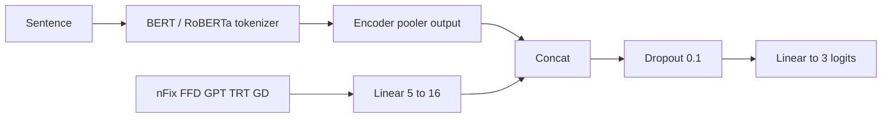

# Transformer Emotion Analysis with Gaze

Personal research code for **ternary sentiment classification** that fuses a
transformer sentence encoder with **eye-tracking (gaze) features**.

Two tracks live in this repo:

| Track | Script | Text source | Gaze source | Protocol |
| --- | --- | --- | --- | --- |
| ZuCo-grounded | `model_ZuCo_SST.py` | 400 Stanford Sentiment Treebank sentences that appear in ZuCo Task 1 (normal reading) | Real subject-averaged gaze | 5-fold stratified CV |
| Full SST + predicted gaze | `model_full_SST.py` | 11,853 SST sentences | Predicted / transferred sentence-level gaze | 80 / 10 / 10 hold-out |

Labels are `0 = negative`, `1 = neutral`, `2 = positive`.

This is a **personal** project. It is not company code and is not packaged as a
library. The original training scripts stay at the repo root; new
documentation and runnable examples live under `docs/` and `examples/`.

## Why gaze?

Eye-tracking measures such as first-fixation duration, go-past time, and total
reading time are classic psycholinguistic proxies for processing difficulty.
The hypothesis in these scripts is that a cheap projection of those features,
concatenated with a BERT or RoBERTa `[CLS]` / pooler vector, can help a
sentiment head — especially on the small ZuCo-aligned slice, and as a
transferred signal on the full SST.

## Repository map

```text
.
├── model_ZuCo_SST.py          # RoBERTa/BERT ± gaze, 5-fold CV on 400 sentences
├── model_full_SST.py          # same fusion, hold-out on full SST
├── utils_ZuCo.py              # MATLAB ZuCo → sentence/word tables
├── read_ZuCo_mat.py           # dump 12 subjects to CSV
├── get_average_sentence_level.py
├── convert_full_SST.py        # folder of .txt reviews → ssts_ZuCo.csv
├── SST_data/                  # full SST + sentence-level gaze
├── ZuCo_SST_data/             # 400 aligned sentences + gaze
├── ZuCo_et_csv_data/          # per-subject and averaged gaze
├── gaze_prediction/data/      # word-level predicted gaze (SST, PROVO)
├── result/                    # exploratory scatter/hist plots
├── docs/                      # architecture, pipeline, datasets, caveats
└── examples/                  # numpy/stdlib demos that do not download models
```

## Quick start (docs examples)

The example scripts do **not** download BERT/RoBERTa and do **not** need a GPU.
They only read the CSVs already in the repo.

```bash
python3 -m pip install -r requirements-examples.txt
python3 examples/run_all.py
python3 -m unittest discover -s examples/tests -v
```

Individual demos:

```bash
python3 examples/inspect_datasets.py
python3 examples/split_integrity.py
python3 examples/scaling_check.py
python3 examples/join_check.py
python3 examples/fusion_forward.py
python3 examples/gaze_by_sentiment.py
python3 examples/word_to_sentence.py
```

## Training (heavy)

Install the full stack, then edit the `model_type` constant in the script you
want (`bert`, `roberta`, `bert_eye_tracking`, `roberta_eye_tracking`):

```bash
python3 -m pip install -r requirements.txt
python3 model_ZuCo_SST.py
python3 model_full_SST.py
```

`model_full_SST.py` writes `models/best_{model_type}_model.pth` when validation
accuracy improves. Create the `models/` directory first. See
[docs/reproduction.md](docs/reproduction.md) and
[docs/known-issues.md](docs/known-issues.md) before treating the printed test
numbers as a full-set score.

## Fusion in one picture



The numpy reimplementation of that graph is `examples/fusion_forward.py`.

## Data at a glance

| Resource | Rows | Role |
| --- | ---: | --- |
| `ZuCo_SST_data/combined_sst_et_standard.csv` | 400 | Real gaze, z-scored, used by `model_ZuCo_SST.py` |
| `SST_data/combined_full_sst_et.csv` | 11,853 | Full SST + transferred gaze |
| `SST_data/train_full_sst.csv` | 9,482 | Full-SST train split |
| `ZuCo_et_csv_data/{1-12}_SR.csv` | 299–400 | Per-subject sentence gaze |
| `ZuCo_et_csv_data/word/word_averages_v2.csv` | 7,129 | Subject-averaged word gaze |
| `gaze_prediction/data/prediction_test_v2.csv` | 191,971 | Predicted word gaze for SST |

Full schemas, label counts, and feature definitions are in
[docs/datasets.md](docs/datasets.md) and [docs/features.md](docs/features.md).

## Documentation

- [Architecture](docs/architecture.md)
- [Data pipeline](docs/data-pipeline.md)
- [Datasets and schemas](docs/datasets.md)
- [Gaze feature dictionary](docs/features.md)
- [Experiments and hyperparameters](docs/experiments.md)
- [Reproduction notes](docs/reproduction.md)
- [Known issues](docs/known-issues.md)
- [References](docs/references.md)
- [Worked example](docs/worked-example.md)
- [Examples](examples/README.md)
