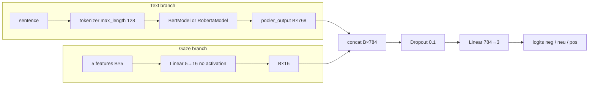

# Architecture

The two training scripts share one fusion module. Text goes through a frozen-shape BERT or RoBERTa encoder (weights **are** trained; nothing is frozen in the loop). Gaze goes through a tiny linear map. The two vectors are concatenated and classified.

## Block diagram



Text-only variants skip the gaze branch and use Hugging Face `*ForSequenceClassification` (built-in classifier on pooled output, still 3 labels).

## Shapes

| Tensor | Shape | Source |
| --- | --- | --- |
| `input_ids` | `[B, 128]` | tokenizer |
| `attention_mask` | `[B, 128]` | tokenizer |
| `eye_tracking_features` | `[B, 5]` | CSV columns listed below |
| `pooler_output` | `[B, 768]` | `base_model(...)` |
| `eye_tracking_output` | `[B, 16]` | `nn.Linear(5, 16)` |
| `combined_output` | `[B, 784]` | `torch.cat(..., dim=1)` then dropout |
| `logits` | `[B, 3]` | `nn.Linear(784, 3)` |

`hidden_layer_size = 16` and `num_eye_tracking_features = 5` are constants in both scripts.

## Code (training scripts)

```python
class EyeTrackingModel(nn.Module):
    def __init__(self, base_model, num_eye_tracking_features, num_labels):
        super().__init__()
        name = "bert-base-uncased" if base_model == BertModel else "roberta-base"
        self.base_model = base_model.from_pretrained(name)
        self.eye_tracking_layer = nn.Linear(num_eye_tracking_features, hidden_layer_size)
        self.classifier = nn.Linear(
            self.base_model.config.hidden_size + hidden_layer_size, num_labels
        )
        self.dropout = nn.Dropout(0.1)

    def forward(self, input_ids, attention_mask, eye_tracking_features):
        pooled = self.base_model(
            input_ids=input_ids, attention_mask=attention_mask
        ).pooler_output
        gaze = self.eye_tracking_layer(eye_tracking_features)
        combined = self.dropout(torch.cat((pooled, gaze), dim=1))
        return self.classifier(combined)
```

Notes that are easy to miss:

- There is **no ReLU / GELU** on the gaze layer. Negative z-scored features stay negative.
- RoBERTa’s `pooler_output` exists but is a linear+tanh on the first token trained with a different pretraining head than BERT NSP. Using it as a sentence vector is a modeling choice, not the default in many RoBERTa fine-tunes (which often take `last_hidden_state[:, 0, :]` without that extra tanh).
- Gaze is **sentence-level**. Word-level CSVs are never read by `model_*.py`.
- Dropout is applied on the **concatenated** vector, so it can drop transformer dims and gaze dims alike.

## Feature order into the five-vector

| Slot | Full SST column | ZuCo column |
| ---: | --- | --- |
| 0 | `nFix` | `nFixations` |
| 1 | `FFD` | `FFD` |
| 2 | `GPT` | `GPT` |
| 3 | `TRT` | `TRT` |
| 4 | `GD` | `GD` |

ZuCo’s extra columns (`omissionRate`, `meanPupilSize`, `SFD`, `SentLen`) stay in the CSV and never enter `CustomDataset.eye_tracking_features` beyond whatever `pandas` concatenation does to the tokenized frame — the tensor passed to `forward` is only those five columns.

## Loss and optimizer

Gaze models: `CrossEntropyLoss()(logits.view(-1, 3), labels.view(-1))`.  
Text-only models: HF sequence-classification loss (`outputs.loss`).

Optimizer: `torch.optim.Adam` at `5e-5` on **all** parameters (encoder + gaze + classifier). No weight decay, no warmup, no gradient clipping.

## Why a NumPy clone exists

`examples/teag_examples/fusion.py` reimplements the gaze concat + dropout + classifier with explicit weights so you can:

- see that a change in the 5-D gaze vector moves logits without downloading BERT
- check softmax / cross-entropy wiring
- dump a tiny architecture report into `docs/assets/`

It does **not** approximate BERT; pooled vectors are either random or passed in.

```bash
PYTHONPATH=examples python3 examples/scripts/demo_fusion_forward.py
```

## Alternatives not implemented

| Idea | Status |
| --- | --- |
| Word-level gaze aligned to tokens | CSVs exist; no model code |
| Gating / FiLM / attention over gaze | not present (plain concat) |
| EEG from ZuCo | not present |
| Freezing the encoder | not present |
| Class-weighted loss | not present (SST is ~39 / 19 / 42) |
| 5-class SST fine-grained labels | not present (3-class only) |
