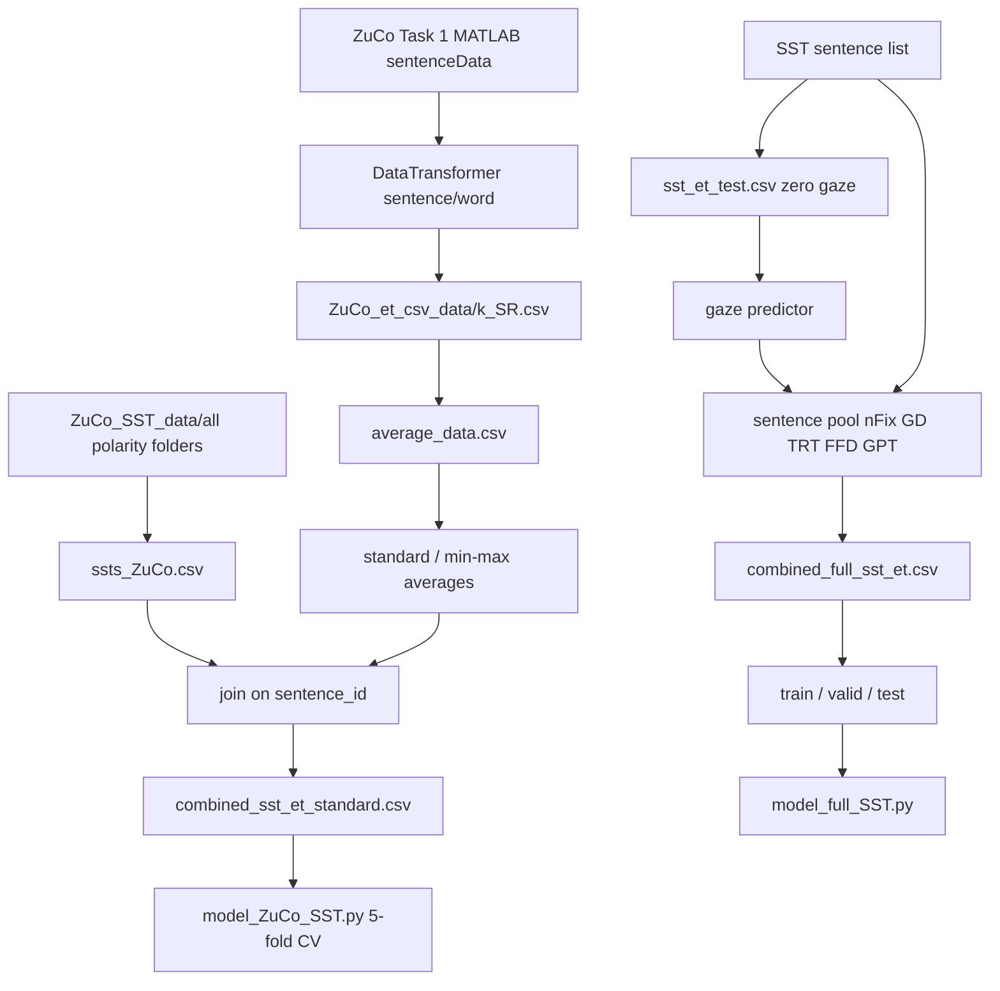

# Data pipeline

Two pipelines share the same five gaze names and the same 3-way label map.
They diverge after sentence-level features exist: one stays on the 400 ZuCo
sentences, the other expands to the full SST with predicted gaze.



## Stage A — ZuCo MATLAB to per-subject CSV

Script: `read_ZuCo_mat.py`  
Helper: `utils_ZuCo.DataTransformer`

```python
DataTransformer('task1', level='sentence', scaling='raw', fillna='zeros')
```

Expected layout (not checked in):

```text
ZuCo_mat_data/task1/*.mat   # 12 subjects
```

`get_matfiles()` currently joins `os.getcwd()` with a **Windows** subdir
`\\ZuCo_mat_data\\`. On Linux you need to change that to `ZuCo_mat_data/task1`
or pass a POSIX `subdir`. See [known-issues.md](known-issues.md).

For each subject `i` in `0..11` the script writes `et_csv_data/{i+1}_SR.csv`.
The files in git live under `ZuCo_et_csv_data/` — the dump directory was
renamed after the script was written.

### Subject / task skip list

ZuCo has incomplete recordings. `DataTransformer.__call__` drops ranges:

| Task | Subject (0-based) | Dropped sentence indices |
| --- | ---: | --- |
| task1 | 2 | 150–249 and 399 |
| task2 | 6 | 0–49 |
| task3 | 3 | 178–224 |
| task3 | 7 | 359+ |
| task3 | 11 | 270–313 and 362–406 |
| task2 | 11 | 50–99 |

This checkout only ships Task 1 CSVs. `3_SR.csv` has 299 rows: ids `0..298`.
The missing tail is ids `299..399` (101 sentences), which matches the
task1 / subject-2 skip plus the shortened feature matrix in `__init__`.

Word-level export uses the same skips and writes `Sent_ID` as `{idx}_NR` for
tasks 1 and 2, or `{idx}_TSR` for task 3.

## Stage B — Average subjects, then scale

Script: `get_average_sentence_level.py`

1. Read `et_csv_data/{1-12}_SR.csv`.
2. Replace `0` with NaN on every column except the first (so missing fixations
   do not pull the mean to zero).
3. `concat` + `groupby(level=0).mean()` — this assumes every file shares the
   same row index `id`.
4. Fit `MinMaxScaler` and `StandardScaler` on the averaged numeric columns.
5. Write `min_max_scaled_average_data.csv` and `standard_scaled_average_data.csv`.

The checked-in averages are the result of that process (or an equivalent
notebook). `examples/scaling_check.py` verifies the two scaled tables against
a numpy reimplementation of min-max and population z-score.

**Gap:** subject 3 has 101 fewer rows. A naive `groupby(level=0).mean()` still
works because pandas aligns on the index; those 101 sentences are averages
over 11 subjects instead of 12. Worth remembering if a sentence in the tail
looks slightly off.

Word-level analogue: `ZuCo_et_csv_data/word/get_average.py` → `word_averages_v2.csv`.

## Stage C — Attach SST labels to ZuCo sentences

Scripts:

- `convert_full_SST.py` (repo root) reads `ZuCo_SST_data/all/{NEGATIVE,POSITIVE,NEUTRAL}/*.txt`
- `ZuCo_SST_data/save_SST_data.py` is the same idea with paths relative to that folder

Output: `ZuCo_SST_data/ssts_ZuCo.csv` with `sentence_id`, `sentence`,
`sentiment_label`.

The combined tables join that file to the scaled average gaze on `id` /
`sentence_id`. The join itself is not a committed script; the products are
`combined_sst_et_standard.csv` and `combined_sst_et_min_max.csv`.

`ZuCo_SST_data/spilt.py` then cuts an 80 / 10 / 10 split (`random_state=42`,
not stratified). Those three files are **unused** by `model_ZuCo_SST.py`.

## Stage D — Full SST skeleton and predicted gaze

`SST_data/stts_all_sentence_level.csv` is a headerless list of
`sentence, POLARITY`. `SST_data/convert_sst_to_et.py` tokenizes with NLTK
`word_tokenize`, keeps `[A-Za-z]+` tokens, and writes
`sst_et_test.csv` with gaze columns filled by `0`.

A separate gaze predictor (not in this repo) writes
`gaze_prediction/data/prediction_test_v2.csv` in the same
`(sentence_id, word_id, word, nFix, FFD, GPT, TRT, GD)` layout. Sentence-level
pooling of those predictions, plus the integer label map, becomes
`SST_data/combined_full_sst_et.csv`.

`SST_data/spilt.py` cuts that table 80 / 10 / 10 (`random_state=42`,
not stratified) into the three files `model_full_SST.py` loads.

## Stage E — What each training script consumes

```text
model_ZuCo_SST.py
  path:  ZuCo_SST_data/combined_sst_et_standard.csv
  gaze:  nFixations, FFD, GPT, TRT, GD
  split: StratifiedKFold(5, shuffle=True, random_state=42)
  tokenize: RoBERTa or BERT, max_length=128, batched HuggingFace map

model_full_SST.py
  paths: SST_data/{train,valid,test}_full_sst.csv
  gaze:  nFix, FFD, GPT, TRT, GD
  split: precomputed hold-out
  tokenize: same
```

Both wrap the tokenized table in a `CustomDataset` that returns
`input_ids`, `attention_mask`, `labels`, and a float32 gaze vector.

## Join keys cheat sheet

| Left | Right | Key |
| --- | --- | --- |
| `ssts_ZuCo.csv` | `standard_scaled_average_data.csv` | `sentence_id` = `id` |
| `sst_et_test.csv` | `prediction_test_v2.csv` | `sentence_id`, `word_id` |
| `word/*_SR.csv` | sentence `*_SR.csv` | `Sent_ID` prefix = `id` |

`examples/word_to_sentence.py` rebuilds subject-1 sentence `nFixations` from
the word table (mean over words with a non-zero gaze vector) and compares it
to `ZuCo_et_csv_data/1_SR.csv`.
