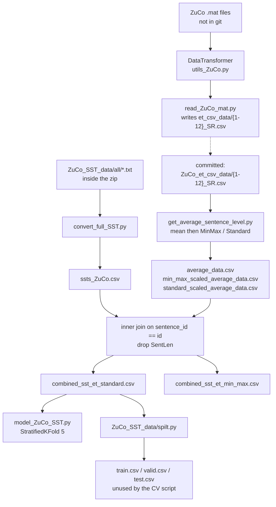
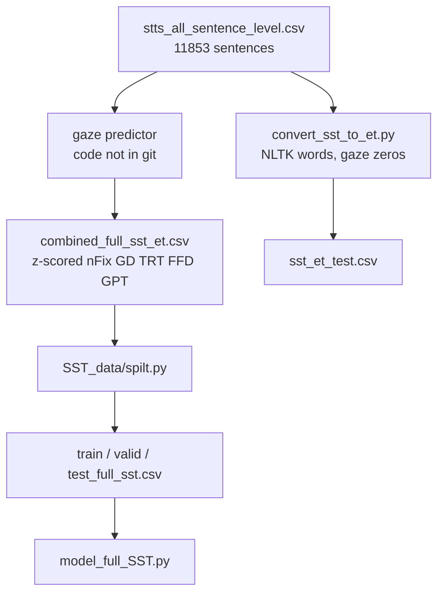

# Data pipeline

How the committed CSVs relate to the original scripts. Several scripts still point at directories that **do not match** the git layout; the arrows below show both the intended flow and the path mismatch.





## Stage A — MATLAB to per-subject CSV

`utils_ZuCo.DataTransformer.__call__(subject)` loads `sentenceData` from a `.mat` file via `scipy.io.loadmat(..., squeeze_me=True, struct_as_record=False)`.

For **sentence** level it accumulates word attributes `nFixations, meanPupilSize, GD, TRT, FFD, SFD, GPT`, divides by the number of words that had any nonzero value, and stores `SentLen` and `omissionRate`.

Known skip rules (Task 1, the only task committed here):

```text
task1, subject == 2: skip original indices 150–249 inclusive and 399
```

That is 100 + 1 = 101 sentences, leaving 299 rows. The surviving rows are **reindexed** from 0. Rows 0–149 still correspond to original sentences 0–149. Rows 150–298 correspond to original sentences 250–398. See [known-issues.md](known-issues.md) for what that does to a naive 12-subject mean.

`get_matfiles()` joins `os.getcwd() + '\\ZuCo_mat_data\\' + task`. On Linux that backslash path does not resolve unless you edit it.

`read_ZuCo_mat.py` writes to `et_csv_data/` with `scaling='raw'` and `fillna='zeros'`.

## Stage B — Average across subjects

`get_average_sentence_level.py`:

1. Read `et_csv_data/{1–12}_SR.csv`.
2. Replace 0 with NaN on every column except the first.
3. `pd.concat(dataframes).groupby(level=0).mean()` — this groups on the **DataFrame index** (row number), not on a stable sentence id.
4. Min-max and standard scale the averaged numeric columns (including `SentLen`, excluding the restored `id`).

Committed outputs are under `ZuCo_et_csv_data/` with the same filenames.

Word-level `ZuCo_et_csv_data/word/get_average.py` concatenates the same way, copies `id, Sent_ID, Word_ID, Word, WordLen` from subject 1, and fills null words with `unknown`.

## Stage C — Sentiment text for the 400 ZuCo sentences

`convert_full_SST.py` walks `ZuCo_SST_data/all/{NEGATIVE,POSITIVE,NEUTRAL}/*.txt`, maps folder → `{0,1,2}`, parses `sentence_id` from the filename, sorts, writes `ssts_ZuCo.csv`.

`save_SST_data.py` is a copy that writes `output.csv` and uses paths relative to `ZuCo_SST_data/`.

## Stage D — Join text and gaze

Not a dedicated script in the original tree. The committed combined files match:

```python
text.merge(
    gaze.rename(columns={"id": "sentence_id"}),
    on="sentence_id",
    how="inner",
).drop(columns=["SentLen"])
```

`examples/teag_examples/pipeline.py` reconstructs both scalings and checks them against git. `nFixations` matches `combined_sst_et_standard.csv` with max abs error 0.

## Stage E — Splits

`spilt.py` in each data folder:

```python
train, valid_test = train_test_split(df, test_size=0.2, random_state=42)
valid, test = train_test_split(valid_test, test_size=0.5, random_state=42)
```

No `stratify=` argument, so ZuCo valid/test label counts wobble. Full SST is large enough that class shares stay close to 39% / 19% / 42%.

`model_ZuCo_SST.py` ignores those split files and runs `StratifiedKFold(n_splits=5, shuffle=True, random_state=42)` on the 400-row combined table.

## Stage F — Full SST predicted gaze

1. Start from `stts_all_sentence_level.csv`.
2. A gaze predictor (not in this repo) emits word-level `nFix, FFD, GPT, TRT, GD`.
3. Those predictions are aggregated and z-scored into `combined_full_sst_et.csv`.
4. `SST_data/spilt.py` builds the three splits `model_full_SST.py` loads.

`convert_sst_to_et.py` is an alternate word-level export with **zeros**, not the predicted values. `prediction_test_v2.csv` is the large word-level prediction table (191,971 rows).

## Tokenization used at train time

Both model scripts:

```python
tokenizer(..., padding="max_length", truncation=True, max_length=128)
```

BERT: `BertTokenizer` / `bert-base-uncased`.  
RoBERTa: `RobertaTokenizer` / `roberta-base`.

This is **not** the NLTK `[A-Za-z]+` tokenization used to build `sst_et_test.csv`. Word-level gaze rows therefore do not line up 1:1 with WordPiece / BPE tokens. Fusion in this project is **sentence-level gaze only**.

## Replaying the join without MATLAB

```bash
PYTHONPATH=examples python3 examples/scripts/reconstruct_zuco_combined.py
PYTHONPATH=examples python3 examples/scripts/check_subject_alignment.py
PYTHONPATH=examples python3 examples/scripts/check_splits.py
```
