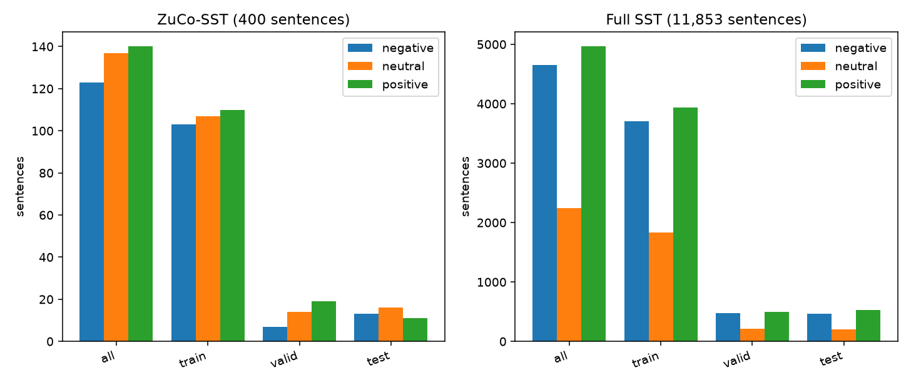
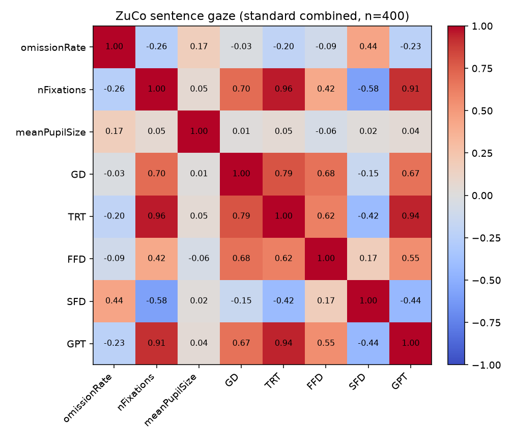
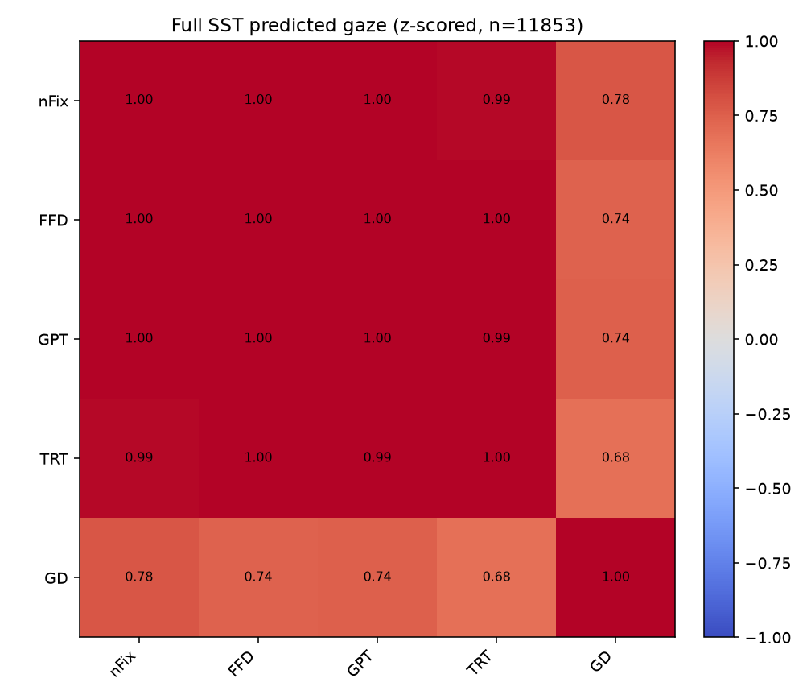
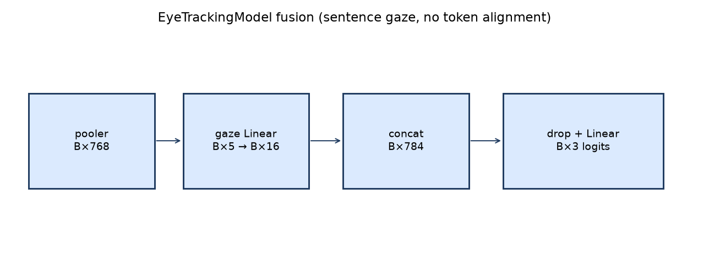

# Examples walkthrough

This page is the expected output of `make examples` / `python3 examples/scripts/run_all.py` after `pip install -r requirements-examples.txt`. Commands assume the repository root. Pytest (`make test`) is 31 cases against the committed CSVs plus a hand-checked NumPy forward pass.

## 1. Dataset inventory

```bash
python3 examples/scripts/summarize_datasets.py
```

| Table | Rows | Missing | Labels (0/1/2) |
| --- | ---: | ---: | --- |
| `ZuCo_SST_data/ssts_ZuCo.csv` | 400 | 0 | 123 / 137 / 140 |
| `ZuCo_SST_data/combined_sst_et_standard.csv` | 400 | 0 | 123 / 137 / 140 |
| `ZuCo_SST_data/train.csv` | 320 | 0 | 103 / 107 / 110 |
| `ZuCo_SST_data/valid.csv` | 40 | 0 | 7 / 14 / 19 |
| `ZuCo_SST_data/test.csv` | 40 | 0 | 13 / 16 / 11 |
| `SST_data/combined_full_sst_et.csv` | 11853 | 0 | 4649 / 2241 / 4963 |
| `SST_data/train_full_sst.csv` | 9482 | 0 | 3710 / 1833 / 3939 |
| `SST_data/valid_full_sst.csv` | 1185 | 0 | 476 / 209 / 500 |
| `SST_data/test_full_sst.csv` | 1186 | 0 | 463 / 199 / 524 |
| `ZuCo_et_csv_data/3_SR.csv` | **299** | 0 | — |
| other `*_SR.csv` sentence files | 400 | 0 | — |
| `word_averages_v2.csv` | 7129 | 0 | — |
| `provo.csv` | 2659 | 0 | — |
| `prediction_test.csv` | 1751 | 0 | — |



ZuCo valid/test are 40 rows each, so class counts wobble (valid is 7 / 14 / 19). Full SST stays near 39% / 19% / 42%.

## 2. Gaze correlations

```bash
python3 examples/scripts/analyze_gaze_features.py
```

Measured ZuCo timings cluster (`nFixations`–`TRT` r ≈ 0.96) while pupil size is almost orthogonal. Predicted full-SST `nFix` / `FFD` / `GPT` / `TRT` are essentially one channel (r ≥ 0.986); `GD` is the only one with much leftover variance (r ≈ 0.68–0.78).

Label correlation is weak on both tracks (max |r| ≈ 0.07 ZuCo FFD, ≈ 0.06 SST GD).





## 3. Split leakage check

```bash
python3 examples/scripts/check_splits.py
```

Both 80/10/10 splits have **disjoint** `sentence_id` sets whose union **equals** the combined table. `model_ZuCo_SST.py` does not use the ZuCo 320/40/40 files (it re-does StratifiedKFold on the 400).

## 4. Reconstruct the ZuCo join

```bash
python3 examples/scripts/reconstruct_zuco_combined.py
```

`ssts_ZuCo.csv` inner-joined to scaled averages on `sentence_id == id`, dropping `SentLen`:

- standard scaling: max |Δ gaze| = 4.4e-16 (float noise)
- min-max scaling: max |Δ gaze| = 0
- sentence text and labels match exactly

## 5. Subject 3 alignment

```bash
python3 examples/scripts/check_subject_alignment.py
```

`3_SR.csv` has 299 rows. `SentLen` matches subject 1 on rows 0–149 and first disagrees at row **150**. Compacted row 150 is original sentence **250** (`SentLen` 15, 19, 29, 25, 25, …). Row-wise `groupby(level=0).mean()` therefore mixes different movie-review sentences after that point. Full write-up: [known-issues.md](known-issues.md)#3.

## 6. Word-level preview

```bash
python3 examples/scripts/preview_word_gaze.py
```

- ZuCo `word_averages_v2.csv`: 7,129 tokens, 400 `Sent_ID`s, mean word length 4.85, mean `nFixations` 1.11, 1.3% zeros
- `prediction_test.csv`: 1,751 predicted-gaze tokens, sentences 300–399
- Provo extract: 2,659 tokens, 134 sentences, `fixProp` instead of `GD`

Sentence-level `model_*.py` files never read these tables. Historical pairwise plots: [`result/`](../result/).

## 7. Fusion forward pass (NumPy)

```bash
python3 examples/scripts/demo_fusion_forward.py
```



On 8 real ZuCo gaze rows with **random** pooled BERT-sized vectors (not a trained encoder):

- concat width 784
- mean |Δ logit| vs zero gaze ≈ `[0.075, 0.264, 0.026]`
- 6 gaze pairs flip argmax on a fixed pooled vector
- train dropout is stochastic; eval is deterministic
- cross-entropy on that random batch ≈ 1.13 (not an accuracy claim)

The point is the wiring: `Linear(5, 16)` with no activation, concat, dropout, `Linear(784, 3)`.

## Regenerating figures

`docs/assets/*.png` and `docs/assets/*.md` are overwritten by the scripts. Re-run `make examples` after changing loaders or plots, then commit if the figures should stay in git.
