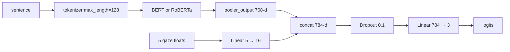

# Model architecture

Both trainers implement the same four `model_type` strings:

| `model_type` | Encoder | Gaze head | Classification |
| --- | --- | --- | --- |
| `bert` | `BertForSequenceClassification` | no | built-in 3-way head |
| `roberta` | `RobertaForSequenceClassification` | no | built-in 3-way head |
| `bert_eye_tracking` | `BertModel` pooler | `Linear(5 → 16)` | `Linear(784 → 3)` |
| `roberta_eye_tracking` | `RobertaModel` pooler | `Linear(5 → 16)` | `Linear(784 → 3)` |

Defaults in both files: `model_type = 'roberta_eye_tracking'`.



---

## EyeTrackingModel

Copied in both `model_ZuCo_SST.py` and `model_full_SST.py`:

```python
class EyeTrackingModel(nn.Module):
    def __init__(self, base_model, num_eye_tracking_features, num_labels):
        super().__init__()
        name = 'bert-base-uncased' if base_model == BertModel else 'roberta-base'
        self.base_model = base_model.from_pretrained(name)
        self.eye_tracking_layer = nn.Linear(num_eye_tracking_features, hidden_layer_size)
        self.classifier = nn.Linear(
            self.base_model.config.hidden_size + hidden_layer_size, num_labels
        )
        self.dropout = nn.Dropout(0.1)

    def forward(self, input_ids, attention_mask, eye_tracking_features):
        base_output = self.base_model(input_ids=input_ids, attention_mask=attention_mask)
        pooled_output = base_output.pooler_output
        eye_tracking_output = self.eye_tracking_layer(eye_tracking_features)
        combined = torch.cat((pooled_output, eye_tracking_output), dim=1)
        combined = self.dropout(combined)
        return self.classifier(combined)
```

Constants: `num_eye_tracking_features = 5`, `hidden_layer_size = 16`,
`num_labels = 3`.

This is **late fusion**. The encoder never sees gaze. Gaze never sees
tokens. They meet as a concatenation just before the label layer.

### Pooler, not CLS-mean

`pooler_output` is the encoder’s dedicated sentence vector: for BERT,
`tanh(W · h_[CLS] + b)`; for RoBERTa, the built-in pooler on the first
token. It is not a mean over word pieces and it is not gaze-weighted.
A token-level gaze model would need a different forward pass
(per-subword features, or a word-piece alignment from `Word_ID`).

### No activation on the gaze MLP

`eye_tracking_layer` is a single linear map. There is no ReLU between
the 5-d input and the 16-d concat. The gaze contribution is an affine
rotation of the five reading-time numbers. Non-linearity starts at the
classifier (and at softmax / cross-entropy).

### Dropout only on the concat

`Dropout(0.1)` sits on the 784-d vector, not inside the encoder. Encoder
internal dropout stays at the Hugging Face default.

---

## Loss and optimizer

Gaze models:

```python
logits = model(input_ids, attention_mask, gaze)
loss = CrossEntropyLoss()(logits.view(-1, 3), labels.view(-1))
```

Text-only models use the Hugging Face sequence-classification loss
(`outputs.loss`), which is also cross-entropy over 3 labels.

Optimizer: `Adam` on **all** parameters, `lr = 5e-5`. There is no
layer-wise decay, no freeze of the encoder, and no separate gaze-head
learning rate. On 400 sentences that means the 110M encoder is fully
trainable. The 5-fold script runs 20 epochs × 5 folds; that is the
expensive setting.

---

## Tokenization

```python
tokenizer(examples['sentence'], padding='max_length', truncation=True, max_length=128)
```

SST snippets are short; 128 is plenty. Padding is to the max length
(not dynamic batch padding), so every batch is dense `batch × 128`.
That is wasteful on CPU and acceptable on GPU. The example suite does
not tokenize with transformers; the toy fusion uses hashed n-grams.

---

## Dataset wrapper

`CustomDataset` returns:

```text
input_ids:          LongTensor [128]
attention_mask:     LongTensor [128]
labels:             numeric sentiment_label
eye_tracking_features: FloatTensor [5]
```

Text-only forward paths ignore `eye_tracking_features` but the column
is still loaded. That keeps one dataset class for all four model types.

---

## What differs between the two trainers

| | `model_ZuCo_SST.py` | `model_full_SST.py` |
| --- | --- | --- |
| Rows | 400 | 9,482 / 1,185 / 1,186 |
| Gaze names | `nFixations, FFD, GPT, TRT, GD` | `nFix, FFD, GPT, TRT, GD` |
| Split | `StratifiedKFold(5, seed=42)` | fixed CSVs |
| Epochs | 20 (no early stopping) | 5 |
| Batch | 16 | 256 |
| Checkpoint | none (last epoch of each fold) | `models/best_{type}_model.pth` on valid **accuracy** |
| Reported number | mean fold acc / P / R / F1 | test acc / P / R / F1 |

Metrics are always `sklearn` weighted averages:

```python
precision_score(..., average='weighted')
recall_score(..., average='weighted')
f1_score(..., average='weighted')
```

Weighted F1 on a 3-class problem with a smaller neutral class will sit
close to accuracy. Macro F1 is not computed in the trainers. The toy
example prints both.

---

## Intended vs actual test loop (full SST)

`model_full_SST.py` accumulates validation predictions with
`all_preds.extend(...)`, but the **test** loop assigns:

```python
all_preds = preds.cpu().numpy()
all_labels = labels.cpu().numpy()
```

That keeps only the last batch (up to 256 of 1,186 test rows). The
printed “Test Acc” is therefore not a full-test metric. Details and a
corrected snippet: [known-issues.md](known-issues.md).

The architecture itself is unaffected. `examples/lib/fusion.py` restates
the concat math without PyTorch so the write-up can be tested on CPU.

---

## Parameter sketch

Approximate trainable sizes (base, uncased / RoBERTa-base):

| Block | Parameters |
| --- | ---: |
| Encoder | ~110 M |
| Gaze `Linear(5, 16)` | 96 |
| Classifier `Linear(784, 3)` | 2,355 |
| BERT/RoBERTa built-in class head | ~2,307 |

The gaze path is tiny. If fusion helps, it is because those 16 numbers
are informative, not because the head has capacity. If fusion *hurts*,
look at scale mismatch or at the projected-gaze distribution before
adding layers.

---

## Alternatives not implemented here

- **Early fusion**: add a gaze embedding to each word-piece. Needs
  word–subword alignment from `ZuCo_et_csv_data/word/`.
- **Cross-attention**: let tokens attend to a 5-d gaze “memory”.
- **Gaze-only probe**: linear layer on `g` with no encoder. The toy
  script includes this as a sanity check; it should beat chance only
  weakly if gaze is not a proxy label.
- **Subject as a random effect**: 12-subject variance is averaged out
  before training. A mixed-effects or per-subject model is a different
  project.

Personal preference for the next experiment: keep late fusion, add a
ReLU + LayerNorm on the 16-d gaze vector, and report macro F1 plus the
gaze-only probe on the same folds.
