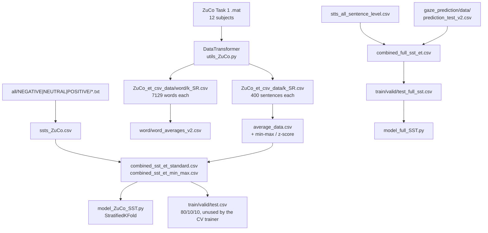

# Data pipeline

Two extraction paths feed the two trainers. Nothing in this clone
re-downloads SST or ZuCo; the CSVs are already the outputs of the path
below.

---

## Stage 1 — MATLAB to subject CSVs

`read_ZuCo_mat.py` builds a `DataTransformer('task1', level='sentence',
scaling='raw', fillna='zeros')` and calls it for subjects `0 … 11`. Each
call:

1. Resolves 12 `.mat` paths via `get_matfiles('task1')`.
2. Loads `sentenceData` with `squeeze_me=True, struct_as_record=False`.
3. Walks sentences, skipping known-bad index ranges (Task 1 only drops
   a block on subject 2; Tasks 2 and 3 have more).
4. Writes `et_csv_data/{k}_SR.csv`. The checked-in copies were moved to
   `ZuCo_et_csv_data/`.

`get_matfiles` concatenates `os.getcwd()` with a **backslash** subdir
`\\ZuCo_mat_data\\`. That is a Windows-era path. On Linux you need to
point it at `ZuCo_mat_data/task1` or change the separator. The subject
CSVs already exist, so this stage is optional.

Word-level extracts use the same class with `level='word'` and add
`Sent_ID`, `Word_ID`, `Word`, `WordLen`. First-token lowercasing and
punctuation stripping happen in `__call__`.

---

## Stage 2 — Cross-subject mean

### Sentence level

`get_average_sentence_level.py`:

1. Read `1_SR.csv` … `12_SR.csv`.
2. Replace `0` with `NaN` in every column except the first (so `id` /
   `SentLen` stay intact — `SentLen` is never zero here).
3. `concat` + `groupby(level=0).mean()` — this is a **positional** mean,
   which is correct only because every file has the same 400-row order.
4. Fit `MinMaxScaler` and `StandardScaler` on the numeric columns.
5. Write `min_max_scaled_average_data.csv` and
   `standard_scaled_average_data.csv`.

Turning exact-zero gaze into NaN before the mean is a modelling choice:
a skip does not vote as “zero milliseconds”, it is treated as missing.
`omissionRate` is not zeroed this way (it lives in a later column and
is rarely exactly 0). If you want skips to pull the mean down, do not
replace zeros.

### Word level

`ZuCo_et_csv_data/word/get_average.py` takes the mean of
`nFixations, meanPupilSize, GD, TRT, FFD, SFD, GPT` by row position,
then attaches identity columns from `1_SR.csv`. Zeros are **kept** in
the current script (the `replace(0, nan)` line is commented out). That
is a different skip policy from the sentence-level averager.

---

## Stage 3 — Join text and gaze (400 sentences)

`convert_full_SST.py` walks `ZuCo_SST_data/all/{NEGATIVE,POSITIVE,NEUTRAL}`
and writes `ssts_ZuCo.csv` with `sentence_id, sentence, sentiment_label`.
`save_SST_data.py` is the same idea with paths relative to
`ZuCo_SST_data/`.

The join onto gaze is a same-index concat: sentence `k` in
`ssts_ZuCo.csv` is sentence `k` in `average_data.csv`. The two
`combined_sst_et_*.csv` files are that join after scaling.

`ZuCo_SST_data/spilt.py` then does `train_test_split(..., test_size=0.2,
random_state=42)` and splits the remainder in half. Those 320/40/40
files are **not** what `model_ZuCo_SST.py` trains on. The trainer
ignores them and uses 5-fold CV so each sentence is evaluated once.

---

## Stage 4 — Full SST with projected gaze

`SST_data/stts_all_sentence_level.csv` is a headerless dump of SST
phrases plus a string polarity. `SST_data/convert_sst_to_et.py`
tokenizes each line with NLTK `word_tokenize`, drops non-letters, and
writes a word table with zeroed gaze columns (`sst_et_test.csv`).

A separate prediction model (not trained in this clone) fills those
zeros. The large filled table is
`gaze_prediction/data/prediction_test_v2.csv`. Sentence-level projected
features in `combined_full_sst_et.csv` are an aggregation of that
word-level prediction (or of an earlier sibling). They are standardized
enough to take negative values.

`SST_data/spilt.py` applies the same 80/10/10, `random_state=42` recipe
to `combined_full_sst_et.csv`. `model_full_SST.py` reads the three
outputs and does a single train run with a validation-selected
checkpoint.

---

## Stage 5 — Tokenization inside the trainers

Both trainers:

1. Load the CSV with pandas.
2. Keep the gaze frame aside.
3. Wrap `sentence, sentiment_label` in a Hugging Face `Dataset`.
4. Call `tokenizer(..., padding='max_length', truncation=True,
   max_length=128)`.
5. Convert back to a pandas frame and concat gaze columns.
6. Wrap in `CustomDataset`, which stores `input_ids`, `attention_mask`,
   integer labels, and a float gaze vector.

BERT uses `bert-base-uncased`; RoBERTa uses `roberta-base`. The gaze
vector is **not** aligned to subword tokens. It is one vector per
sentence, concatenated with the pooler output. There is no
token-level gaze embedding in these scripts.

---

## Idempotence

Safe to re-run without extra inputs:

- `examples/inspect_datasets.py`
- `examples/gaze_feature_stats.py`
- `examples/compare_scalings.py`
- `ZuCo_SST_data/spilt.py` / `SST_data/spilt.py` (same seed → same rows)

Needs extra files that are not in the clone:

- `read_ZuCo_mat.py` (MATLAB)
- `convert_full_SST.py` (`all/*.txt`)
- `convert_sst_to_et.py` (NLTK `punkt`, and it overwrites
  `sst_et_test.csv`)

Needs a GPU and Hub weights:

- `model_ZuCo_SST.py`
- `model_full_SST.py`

---

## Directory-name drift

Several scripts were written when folders had shorter names:

| Script constant | Checked-in path |
| --- | --- |
| `et_csv_data` | `ZuCo_et_csv_data` |
| `\\ZuCo_mat_data\\` | not present |
| `training_data/word_averages_v2.csv` | `ZuCo_et_csv_data/word/word_averages_v2.csv` |

When you extend a script, prefer the checked-in names. The example
loaders in `examples/lib/paths.py` only know the current tree.
